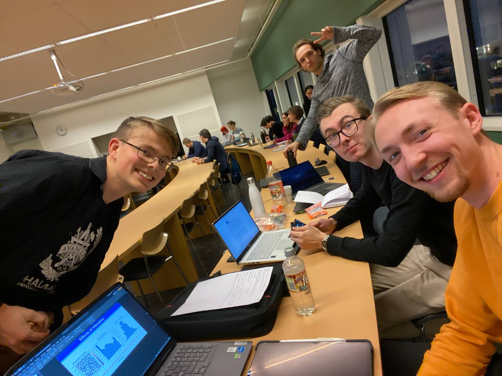
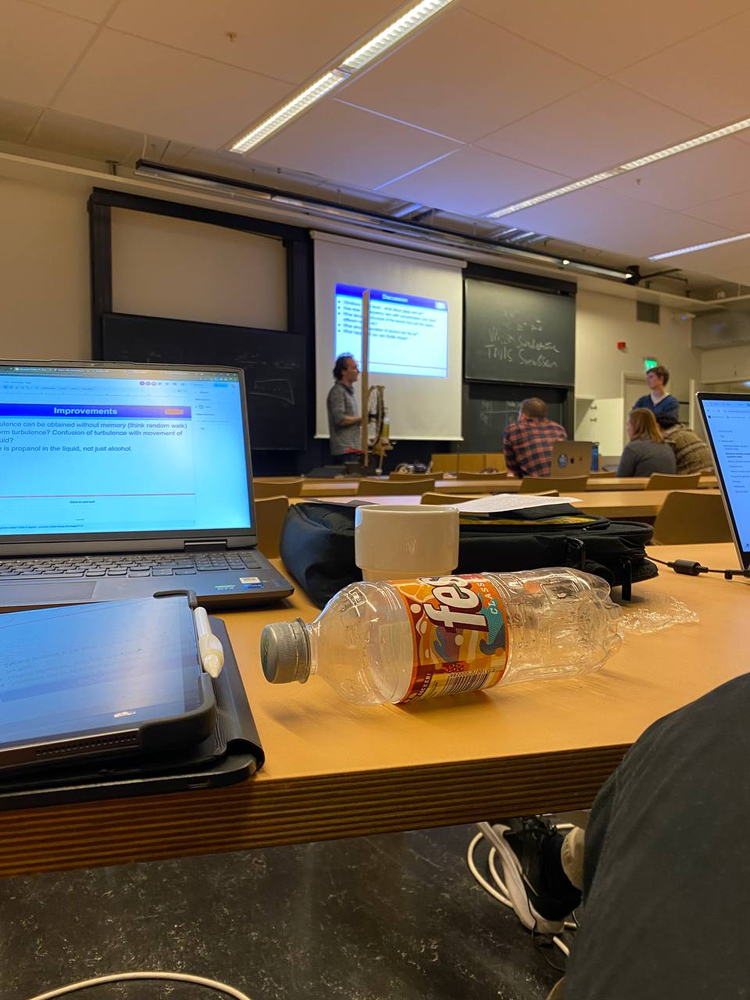
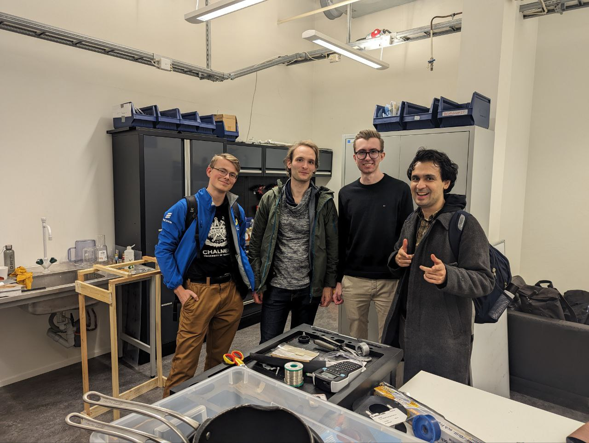

After a great performance during today's Nationals for the International Physicists' Tournament, the Chalmers Team has kept up tradition and won the right to represent Sweden at the International competition.

It's been a pleasure to coach these guys over the past three months and to encourage in-depth discussions over what at first glance may look like *simple* physics problems. As anyone who has been part of the IPT, they are everything but. Everyone toutes their prowess on second order pertubative many-body quantum field theory until they are asked to quantify the behavior of sand.

It's been a while since I've written in this blog, but the last two years of interfacing with the academic apparatus have more than reinforced my idea about the excess of science instrumentalism. Sometimes science should just be for fun, and the IPT is one such opportunities where the inherent value of the science is at full display.

For the uninitiated, the [IPT](iptnet.info) is an international competition for bachelor and masters students in which they work over the course of six months to solve 17 physics problems. Unlike an oylmpiad, however, these problems do not have an a priori exact solution nor a standard method to be solved; thus encouraging the participants to explore a wide range of theoretical, numerical and experimental approaches. 

The competition is composed of a series of Physics Fights, in which the students present, critique and review each others work in a process emulating peer review. This is a great opportunity for young scientists to acquire presentation, debating and persuation skills in a scientific context. 

Technically, I am their Team Leader, but I prefer the term Team Coach, which better defines my approach to the role. Over the dozens of weekly meetings that I've had with these guys, we have discussed the problems, proposed and debated courses of action and came up with solutions for problems accross a wide range of disciplines such as optics, fluid mechanics, statistics, classical mechanics and electromagnetism. Since there is no seniority requirement for the tournament, we have a wide array of students from first year to masters and thus I have had to step in as teacher and give them the tools necessary to advance their solutions as much as possible.

It has been a great opportunity to refine my pedagogical skills and teach in a highly collaborative environment where we are only limited by our creativity and my teaching chops. Something I have found out about teaching physics outside of my solid-state wheelhouse is that I have to re-learn a great deal in order to explain concepts in the easiest way possible and with step-by-step mathematical tools. I have found success with a paradigm that is proving increasingly useful: give them just enough context so they can understand what you are trying to say.

So, we went up to Stockholm to fight for the right to represent Sweden at the International competition. Two fights and four discussion filled rounds later, we walked away with a razor thin point margin and claimed the victory for Chalmers/GU. The KTH guys were good opponents and had some interesting solutions as some of their team members were IPT veterans. Everyone likes an underdog story, so with their 14 students vs our six (four in person, since two couldn't make it), we had the deck stacked against us. In the end, we prevailed or, more accurately, my guys prevailed.

Viktor, Griffin, Erik, Nils (and Marin and Johnathan in absentia) my deepest congratulations and get ready to go to Zurich and kick some serious ass.

