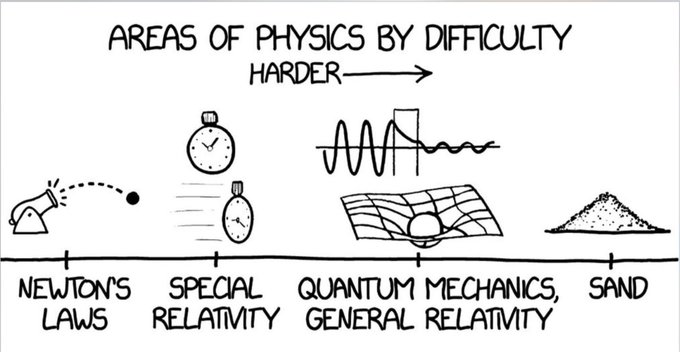

## **Lunch seminar**
We will have a lunch seminar on September 23rd at 11:50 in room FB of building Fysik Örigo. We will give a presentation on the tournament, the associated course and answer any questions you might have.

Have you ever wondered how physical models are created? Why are equations formulated the way they are? What do these relationships reveal about everyday phenomena? If these questions intrigue you, the IPT is just for you!
# What is the IPT?
The International Physicists' Tournament, or IPT for short, is a global competition for physics and engineering students. It seeks to hone theoretical and experimental analytical skills through the exploration of 17 open-ended problems. Over a span of six months, participants will design, build, test, and analyze the systems proposed in these challenges, culminating in a presentation at Warsaw, Poland the following spring.

IPT's problems are framed to be easily comprehensible, yet they demand creativity and a robust grasp of physics for resolution. An added perk? You earn credits that can be applied toward your engineering physics or physics degree. Check out our syllabus [right here](../assets/IPT_course_syllabus.pdf).

<iframe width="560" height="315" src="https://www.youtube.com/embed/kD28edrq_dY?si=GdP843nQ9DkJ6LVp" title="YouTube video player" frameborder="0" allow="accelerometer; autoplay; clipboard-write; encrypted-media; gyroscope; picture-in-picture; web-share" referrerpolicy="strict-origin-when-cross-origin" allowfullscreen></iframe>

## A sample IPT problem
**Kelvin Dropper**

A reservoir containing a conducting liquid is connected to two hoses that release two falling streams of drops, which land in two containers. Each stream passes through a metal ring or open cylinder which is electrically connected to the opposite receiving container. After a while, a spark may be observed between two conducting rods connected to the setup. Use this setup as an electrical generator. Investigate and optimize its power efficiency.

<iframe width="560" height="315" src="https://www.youtube.com/embed/rv4MjaF_wow?si=JBluPDYosJk3Kub7" title="YouTube video player" frameborder="0" allow="accelerometer; autoplay; clipboard-write; encrypted-media; gyroscope; picture-in-picture; web-share" referrerpolicy="strict-origin-when-cross-origin" allowfullscreen></iframe>

# What do I need to know?

As a general requirement, you should be a bachelors or masters student at Chalmers or GU accepted to a physics or engineering program. That said, feel free to apply if you are enthusiastic about the tournament and think you can bring another perspective to the table.

No specific seniority or prior experience is mandated—you'll gain ample knowledge as you delve deep into the problems. If physics excites you and you're keen on acquainting yourself with the methodologies and cognitive processes characteristic of scientists, I'm here to guide you through any required concepts.

# How do I apply?

In order to apply, you must send me a short pre-study report on one of the problems of the [IPT problem list](https://iptnet.info/problems/). You can choose among the following problems:

    4. Traveling Flame  
    6. An Optimal Candle
    10. Rotating Ring
    11. Soft Rescuer
    14. Loud Bicycle 

In your report, outline your initial reactions to the problem. Pose these questions: How would you go about it? Are there relevant equations or principles to consider? Can you conceive an experimental setup to systematically change the variables of the phenomenon??

**Deadline:** The report must be written in english and [emailed to me](mailto:victor.gonzalez@physics.gu.se) in pdf format by **Wednesday October 2nd at 23:59**
