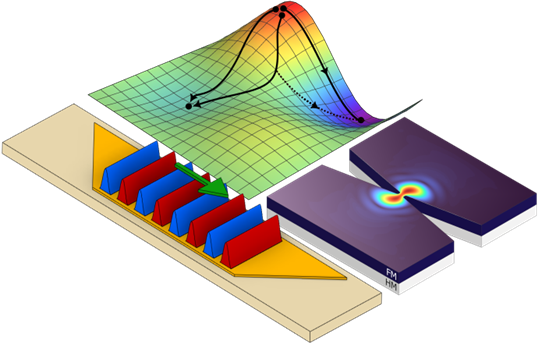

**In my thesis, I explored the construction of microscopic complex networks of oscillators which communicate with each other using magnetic waves. These networks have a wide range of cutting-edge industry-relevant applications, from making AI training more energy-efficient to offering a low-cost alternative to quantum computers.**

Spintronics, short for spin electronics, is a branch of condensed matter physics that aims to control a quantum property of electrons called spin to build fast, small and low power electronic devices. Since spins are the source of magnetism in materials, spintronics leverages the properties and geometry of magnetic materials to build tiny oscillators, roughly the size of a one thousandth of a human hair, which communicate with each other using magnetic waves. Due to their physical properties, a network of these oscillators can operate at very high frequencies and consume less power than one constructed using conventional electronics.

*The gradient descent algorithm (top) is performed when the magnetic waves present in YIG delay line (left) or a spin Hall nano-oscillator (left) evolve according to the laws of physics, and without the need of a programming language.*

Controlling the communication between the oscillators in the network allows the entire system to be programmed in a computing architecture known as an Ising machine (IM) which performs an analog computing algorithm called gradient descent. This algorithm calculates approximate solutions for computationally hard problems (such as optimizing a stock portfolio or finding new organic molecules for medication) in a similar fashion to the neural networks present in modern AI algorithms. What makes the research stand out, is that the spintronic IM does not require an operating system or a programming language, but rather the answer is calculated as the system follows the laws of physics. This physical computation greatly reduces the overhead of the computing architectures and can produce approximate solutions very quickly in a tiny device with low energetic cost. Spintronic oscillator networks can thus pave the way for sustainable AI training, enable edge computing hardware and greatly reduce the material costs for optimization in many industries ranging from biomedical research to quantitative finance. This work shows how cutting-edge magnetic materials research can be the starting point for the construction of next-generation of hardware-based computing accelerators.

