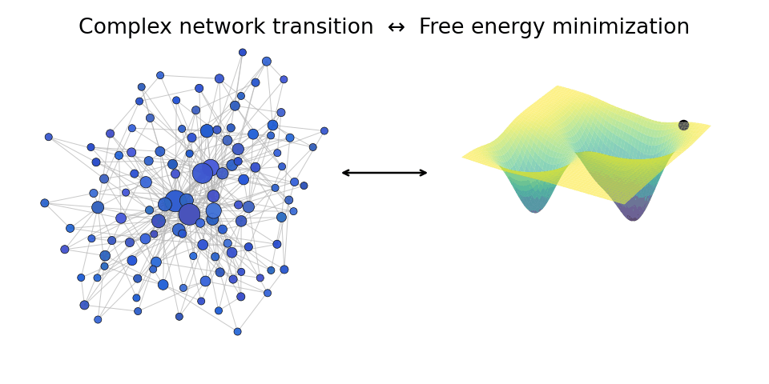

Interesting problems lie at transitions. In complex systems such as the climate, the stock market, the power grid and artificial neural networks, understanding of their stability, disorder and transitions has fueled incredible intellectual and societal progress. The ability to make predictions over complex systems using has allowed us both to understand the natural world, and to create trust in complicated structures with thousands (or even millions) of moving parts. So, it was without hesitation that I took the opportunity to work on such systems and went through a transition of my own.

It has been three months since I arrived at the University of Cambridge to join Prof. Natalia Berloff's group, and I can say that I am excited by the directions of our work within the Heisingberg consortium and beyond. Even though I work for the Faculty of Mathematics now, my background is in computational physics. In my PhD dissertation, we constructed and analysed Ising machines using nanoscopic magnetic oscillators; so my new post might look like a small professional transition. But learning about the mathematical properties behind the evolution of these systems and the theory of spin glasses has opened my horizon to the myriad of open questions that still remain after decades of study into complex systems. Furthermore, mathematics can provide insight and guide further progress into a class of Ising machines that has reshaped our current economic and societal landscapes: artificial neural networks (ANNs).

As Professors Berloff and Laussy have discussed in an [ealier post](https://www.heisingberg.eu/2024/11/18/the-ising-machine-that-thinks/), the intrinsic relation between Ising machines and ANNs emerged from John Hopfield's interest and knowledge of spin glasses when he posed the question: Can an Ising model be trained to perform a useful function? It turns out, it can; and Hopfield, together with Geoffrey Hinton, laid the groundwork for the current machine learning Golden Age where ANNs have been applied to problems as complex as text synthesis and generation, medical drug discovery and genetic sequencing. It is clear that ANNs are here to stay. What it is yet to be established are the limitations and sustainability of the current computational paradigms and a big question: why do ANNs work?

The answer to this question is brief but complex: feedforward ANNs are [Universal Function Approximators](https://doi.org/10.1007%2FBF02551274). Simply, given a number of observations (or measurements), the network evolves, independent of a human operator, into a functional form that can approximate the underlying statistical distribution of the observations to an arbitrary degree; effectively modelling the behavior described by the observations. The end goal for many use cases of applied mathematics (like weather forecasting or data classification) is to model such distributions in order to make predictions with a high degree of confidence; so it's not a surprise that they have been readily adopted by an ever growing industrial machine learning (ML) community. 

Deep neural networks (DNNs) are the most successful of these approximators, though at a steep computational cost, with most state-of-the-art applications requiring wider and deeper networks (at the time of writing, Large Language Models' underlying networks are on the numbers of trillions). And though it is well understood what happens to ANNs at an individual neuron level, a detailed understanding of large networks is not very practical and short of impossible for modern models. This is where the tools of statistical physics come in handy.

Statistical physics is a mathematical framework developed to study enormous emsembles of physical units as collective systems rather than considering the individual behavior of each unit. Thermodynamical models are the prototypical example of such emsembles: though we understand molecular and atomic collisions reasonably well, we use temperature rather than atomic momenta to characterize and make predictions about a volume of gas. Using a statistical rather than a exact description for all particles helps to understand the dynamics of the ensemble as a whole.

Similarly, statistical descriptions of neural networks have helped to understand how they work and come up with better ways to both train them and utilize available computational resources. The transition from micro to macro has brought both greater understanding of ANNs and DNNs and possible paths for improving them. By contrast to the progress made so far in ML through clever engineering and empirical discovery, the framework of statistical physics can be used to systematize these improvements and offer insights into possible future directions.

A current issue in need of insight is the scaling problem in LLMs: designing and training expontentially larger networks has shown diminishing returns in accuracy. Even Yann LeCun (the "Godfather of AI"), has stated that [larger is not better](https://www.businessinsider.com/meta-yann-lecun-scaling-ai-wont-make-it-smarter-2025-4?op=1), as the reasoning ability of DNN-based text chatbots does not appear to scale with the financial and environmental assets poured into their construction. For example, the ML industry has led to [rises in electricity prices](https://www.bloomberg.com/graphics/2025-ai-data-centers-electricity-prices/), [global GPU and RAM shortages](https://www.cnbc.com/2026/01/10/micron-ai-memory-shortage-hbm-nvidia-samsung.html), and [overconsumption and pollution of water sources](https://sustainableict.blog.gov.uk/2025/09/17/ais-thirst-for-water/). For all of these reasons, scaling DNNs do not seem to be a long-term and logically sound strategy to produce industrial and consumer-grade tools, opening the floor for alternative computation architectures, such as those developed by the Heisingberg consortium.

Despite their ubiquity, the rise of DNNs was anything but assured. Although the foundations of "learning matrices" were established as far back as sixty years ago, the breakthrough of using graphical processing units (meant for rendering videogames and animations) for the matrix mutiplication operations necessary for training deep neural networks (DNNs) only came about in the early 2000s. The subsequent bonanza on the application of DNNs to practical mathematical and statistical problems thus relied heavily on a sort of [hardware lottery](https://doi.org/10.1145/3467017) that promoted algorithms reliant on matrix multiplication and relegated other forms algorithms as unfeasible mathematical curiosities.

However, similarly to how expert systems were quickly displaced by neural networks by an unplanned convergence between hardware and software, not matrix-multiplication-based learning schemes might provide scaling advantages over DNNs if they are implemented into specialized hardware. Namely, CPU-bound learning is limited by the so-called von Neumman bottleneck introduced by the serialized movement of data between memory and processor. If the calculations could be done in parallel in the memory itself, that would translate to cheaper, faster and leaner computation, incentivizing research and commercialization of alternative learning architectures.

The Heisingberg project's Ising machine hardware and algorithms are great examples of analogue in-memory computers designed to realize the potential held by a transition from conventional to unconventional computing. At its crux, physics-based computing has the potential to deliver energy-efficient hardware-based computation accelerators purpose-built to realize these alternative learning architectures

Questions abound and the lively discussions with our partners always present me with a fractally complex landscape of what is possible in these systems, which I could not imagine when I picked this niche topic as the central theme of my PhD dissertation. This intersection between nonlinear systems, applied mathematics and statistical physics has compelling open questions with real-world applications, so I am excited to see the collective changes that say that my transition from computational physicist to applied mathematician brings outside of my own neural network reorganization.

*A network transition (left) can be thought of as an energy minimization (right) of free energy of the system. We study such mechanisms in the Heisingberg consortium.*
