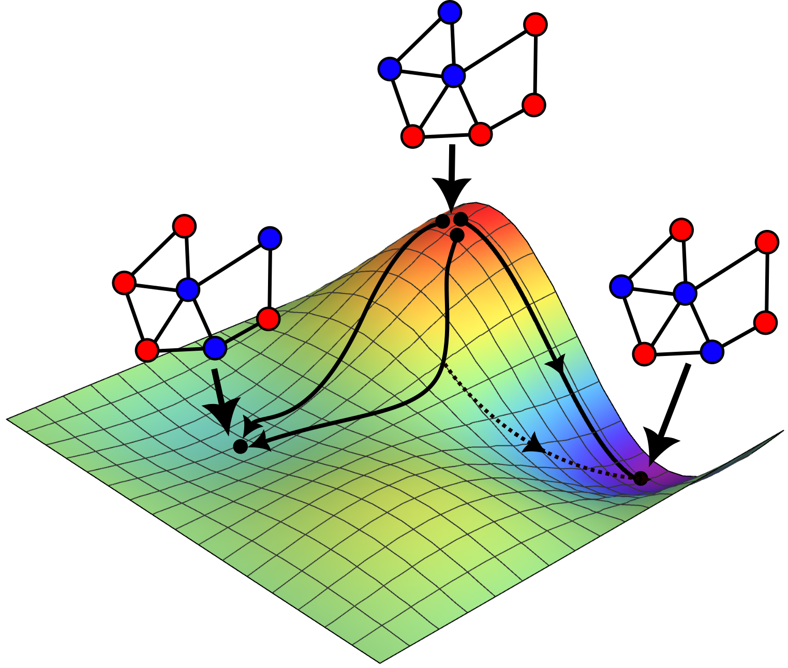
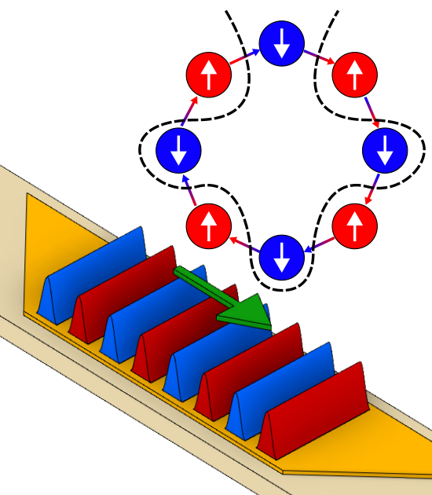
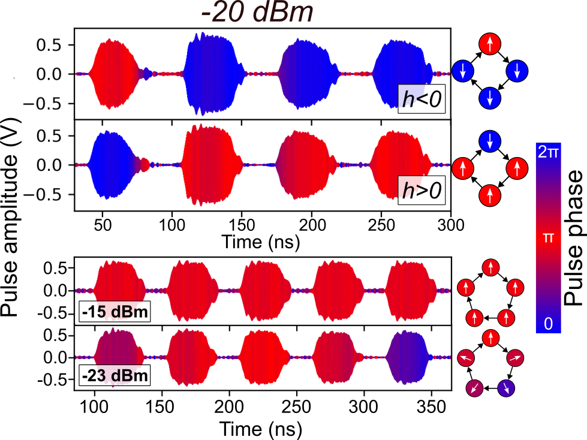

Thank you for attending my talk. The links for the articles I mentioned in the presentation are below, along with bite-sized descriptions of what we achieved in each one. If you would like to discuss further, you can approach me during the conference, email me at: [vhg23.cam.ac.uk](mailto:vhg23@cam.ac.uk) or connect with me on [LinkedIn](https://www.linkedin.com/in/victor-h-gonz%C3%A1lez-129023a1/).

## [Spintronic devices as next-generation computation accelerators](https://doi.org/10.1016/j.cossms.2024.101173){:target="_blank"}

This paper was the basis for the talk, and it is an opinionated review of the current and future directions of spintronic platforms. We propose the distinction of spatially-resolved and time-multiplexed Ising machines, and discuss the differences between the two architectures. We also analyse critical aspects of network control and operational constraints of current systems with the intent of promoting interdisciplinary collaboration and hardware-algorithm co-design. 

Finally, we benchmark spintronic IMs against non-magnetic software and hardware platforms. This is a pedagogical paper written for a general condensed matter audience and a good starting point if you wish to .

## [Voltage control of frequency, effective damping, and threshold current in nano-constriction-based spin Hall nano-oscillators](https://doi.org/10.1063/5.0128786)

This paper is a computational study of the effect of voltage-controlled magnetic anisotropy (VCMA) over the dynamics of spin Hall nano-oscillators (SHNOs). The geometry of constriction-based SHNOs leads to localization of the induced magnetization precession and thus enabling localized control via voltage. SHNO-based IMs require individual control and VCMA is a good candidate for large scale realization, enabling tunning of the oscillation parameters. 

Wave propagation in magnetic media is a fascinating phenomenon with surprising results, such as radiative damping and sigmoid-shaped current thresholds. VCMA has shown much versatility as a mechanism to control the medium itself and thus engineer magnon propagation in individual oscillators.

## [Spin-wave-mediated mutual synchronization and phase tuning in spin Hall nano-oscillators](https://www.nature.com/articles/s41567-024-02728-1)

This paper is an excellent experimental demonstration of the potential of propagating spin waves for coupling arrays of SHNOs. Electrically, we measure in-phase and anti-phase synchronization regimes, and show that the physics of propagating spin waves drives the dissipative coupling responsible for both types of synchronization. To discard oscillation death as a cause, we observe the magneto-active areas directly using $\micro$BLS and show that the phase of the SHNOs is indeed binarized.

We complement these measurements with computational simulations and find that, once again, VCMA can be used to modify the propagation of the spin waves and switch between in-phase and anti-phase synchronization. These results show that pairwise coupling can be effectively tuned via VCMA, charting a path for larger SHNO-based IMs.

## [A numerical model for time-multiplexed Ising machines based on delay-line oscillators](https://doi.org/10.48550/arXiv.2406.07197)

We proposed this mathematical model in order to understand the dynamics of delay-line time-multiplexed IMs better. Based on the nonlinear coefficients present in real IMs, we were able to simulate the operation of time-multiplexed IMs on quadratic problems of different complexity and found that this type of machines operate better at the edge of synchronization. We argue that this is because the generalized force felt by the oscillators is approximately zero and allows the machine to avoid spurious local minima.

We link these nonlinearities with actual properties of electrical circuits, and propose effective ways of tuning these types of IMs.

## [A spinwave Ising machine](https://www.nature.com/articles/s42005-023-01348-0#Abs1)

This is the demonstration of the world's first spinwave Ising machine (SWIM), a time-multiplexed IM that uses spin wave packets propagating in a YIG delay line to construct the artificial spin state. Using phase sensitive amplification, we binarize the phase of the oscillators and induce analogue negative coupling using an additional delay element. We show that the 4 and 8 artificial spins in a chain change their phase to reach the antiparallel ground state. 

This realization shows the potential of magnonic films as memory elements for IMs and paves the way for delay line engineering as an alternative for exciting larger numbers of oscillators in SWIMs.

## [Global biasing using a hardware-based artificial Zeeman term in spinwave Ising machines](https://doi.org/10.1063/5.0185888)

Once we had the SWIM, we wanted to embed graphs with higher complexity using analogue means. Since it has been shown that a 2D Ising model with an global bias is [NP-complete](https://iopscience.iop.org/article/10.1088/0305-4470/15/10/028), we expanded the limits of our machine by adding such bias in the form of an additional RF source at the same frequency as the spins. The phase of this source allows us to favour either in-phase or anti-phase synchronization and transition between parallel and antiparallel alignments despite constant negative coupling, similar to an antiferromagnet in a strong magnetic field. 

By changing the amplitude of the bias signal, we were able to observe a partially aligned phase (similar to a ferrimagnet). We noticed that this "ferrimagnetic" phase was caused by a spin amplitude mismatch. If one of the spins is shorter that the others, it is more energetically favourable to partially align the others with the external field. We also observed signs of phase frustration for an odd number of oscillators, suggesting paths of development for Potts machines (IMs with more than two phases).
